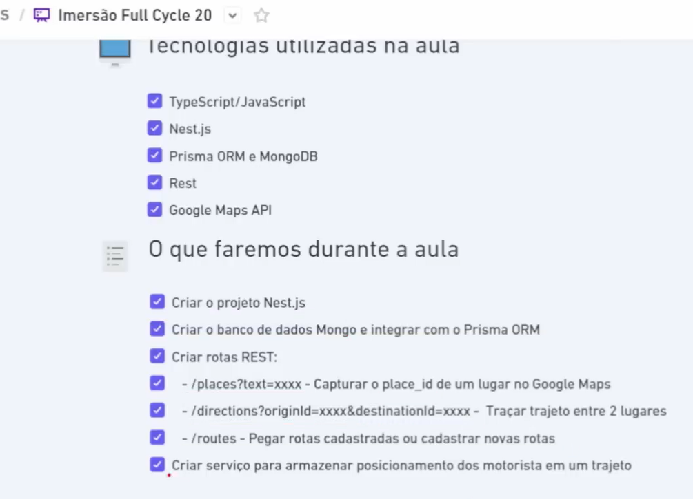
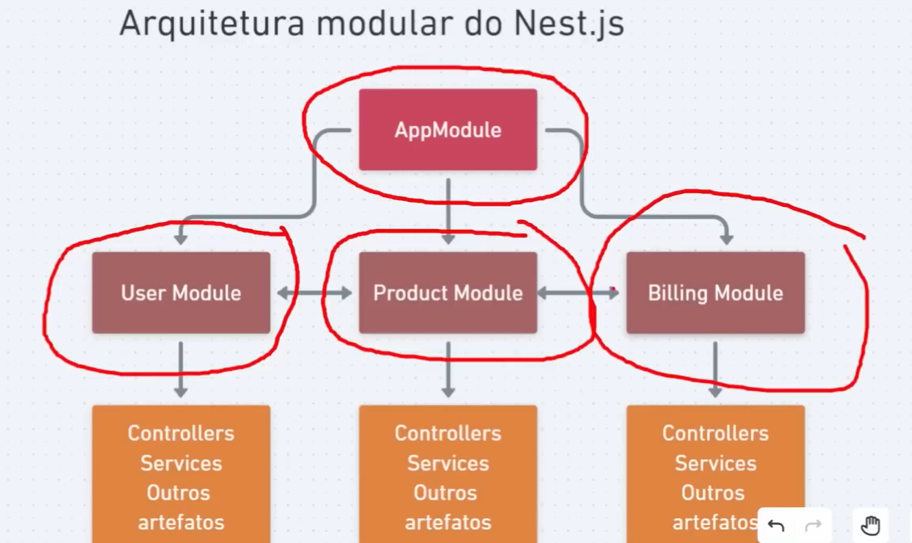
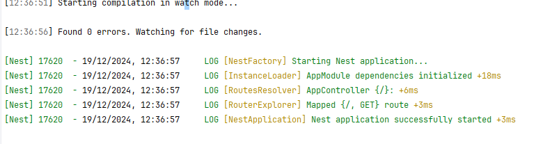

# Nest js backend server
The back end will be used to get places from google maps, create directions from Google maps and finally to create a route within the database.
It integrates with a database and will be our REST Webb server

The server is modular and will have different modules created to build the backend

# Installing Nest Js CLI
run `npm install -g @nestjs/cli`

### Creating the project
run the command `nest new nestjs-api` and chose the `npm` as the package manager
This will create a node project with a package .json

### Running the app
run `npm run start:dev` to spin the server, this should create a dummy hello world endpoint on the address `localhost:300`

