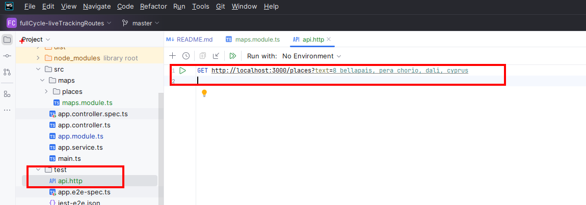

# Nest js backend server
The back end will be used to get places from google maps, create directions from Google maps and finally to create a route within the database.
It integrates with a database and will be our REST Webb server

The server is modular and will have different modules created to build the backend

# Installing Nest Js CLI
run `npm install -g @nestjs/cli`

### Creating the project
run the command `nest new nestjs-api` and chose the `npm` as the package manager
This will create a node project with a package .json

### Running the app
run `npm run start:dev` to spin the server, this should create a dummy hello world endpoint on the address 
[http://localhost:300](localhost:300)

## Nest JS CLI commands
### Creating Modules
run `nest g module <moduleName>` to create a new module, this will create an empty module and add it as imports within the main module

### Creating controller
run `nest g controller <moduleName/controllerName>`

## Testing within the IDE
Creating a file called `fileName.http` will allow the ide to create a local http client and perform requests

# Dependencies
### Google maps
Google maps are used to query places, calculate routes and display
`npm i @googlemaps/google-maps-services-js` 
Google maps will need the following API and Services enabled
* Places API
* other???

### Config - used to inject environment variable 
Used to inject environment variables Eg Google maps api
`npm install @nestjs/config`
