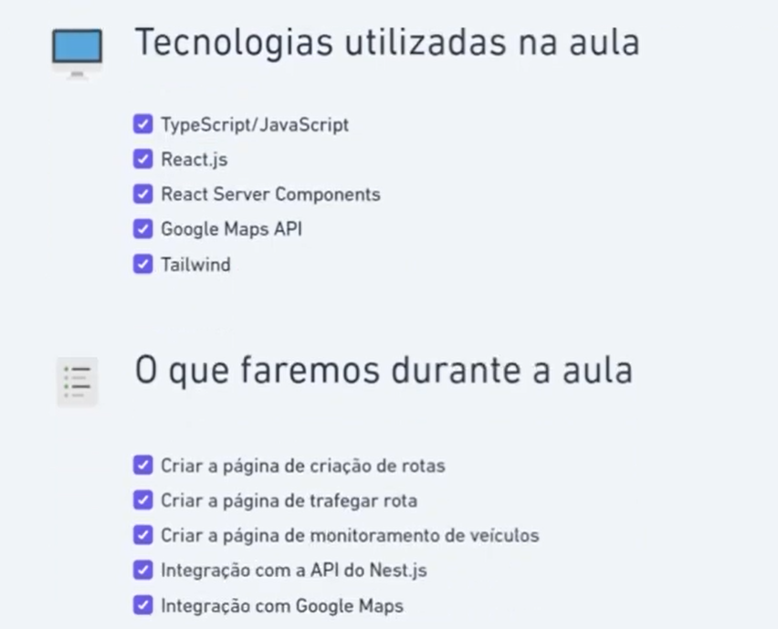
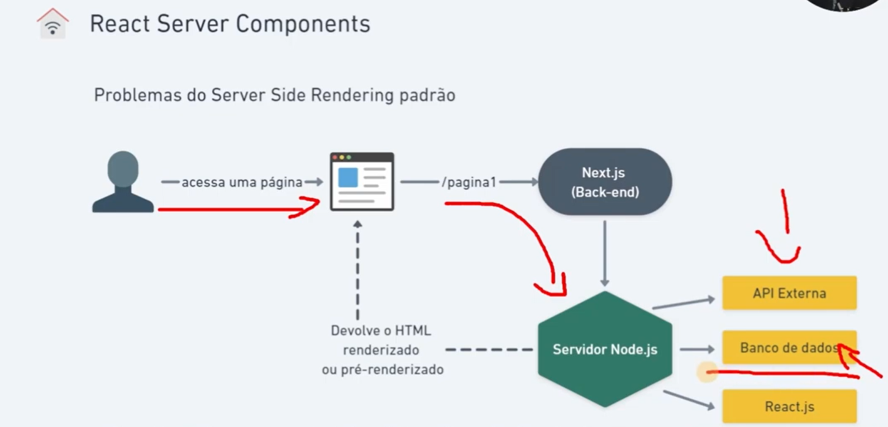

## Next JS fronent
This project will be used to be the front end of the routing track, it uses NextJS framework, with React and tailwind.
It will be mainly SSR.
this also will need to integrate with Google APIs to display the map to the user.
To install NextJS  run the following script `npm install next@latest -g`

# Next Js and SSR
The idea is to have server side rendered pages rather than a traditional SPA. the server will render the page and send the page to the user
only additional JS will be added in case the page needs to.

# Create the project 
run `npx create-next-app@latest nestjs-ui` to create this project

# Running the app
`PORT=3001 npm run dev` - default is port 3000 but it gets changed to 3001 with the run script

Open [http://localhost:3001/new-route](http://localhost:3001/new-route) with your browser to see the result.

# Dependencies
### next JS
run `npm install next@latest -g` this will install the framework globally, not needed to the app itself but necessary to run the app

### Google maps services api and loader
run `npm install @googlemaps/google-maps-services-js @googlemaps/js-api-loader`
and for the types run `npm install @types/google.maps --save-dev`
Google maps will need the following API and Services enabled
* Maps javascript API
* Others needed for the API to display map, check api project

### Lodash
used as a util class to manipulate objects
run `npm install lodash` and for the types run `npm i --save-dev @types/lodash`

You can start editing the page by modifying `app/page.tsx`. The page auto-updates as you edit the file.

This project uses [`next/font`](https://nextjs.org/docs/app/building-your-application/optimizing/fonts) to automatically optimize and load [Geist](https://vercel.com/font), a new font family for Vercel.

## Learn More

To learn more about Next.js, take a look at the following resources:

- [Next.js Documentation](https://nextjs.org/docs) - learn about Next.js features and API.
- [Learn Next.js](https://nextjs.org/learn) - an interactive Next.js tutorial.

You can check out [the Next.js GitHub repository](https://github.com/vercel/next.js) - your feedback and contributions are welcome!

## Deploy on Vercel

The easiest way to deploy your Next.js app is to use the [Vercel Platform](https://vercel.com/new?utm_medium=default-template&filter=next.js&utm_source=create-next-app&utm_campaign=create-next-app-readme) from the creators of Next.js.

Check out our [Next.js deployment documentation](https://nextjs.org/docs/app/building-your-application/deploying) for more details.
