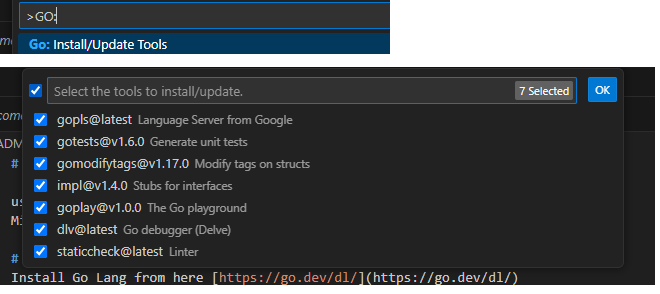

# Simulator - GoLang

used to simulate the cars moving around the map. The main usage for this service is to handle and publish events Eg carMoved, routeCreated...
Microservice built using the Go language.

# Prerequisites
Install Go Lang from here [https://go.dev/dl/](https://go.dev/dl/)
Then install the VsCode extensions to manage Go
* Go extension (from official GO)
* plugins as per picture below. to install the plugins, press ctrl+shift+p and type `GO: Install/Update tools`

# Initialize Go project (Create initial module)
within the terminal type in `go mod init github.com/fullCycle-liveTrackingRoutes/simulator` 
this will create the initial module pointing to the github and the version of GO used. this address can be used for downloading the microservice

# Running the main funcion
on the command line, type in `go run cmd/simulator/main.go`

# Downloading dependencies
Ont he commnad line, type in `go mod tidy` as seen image below

# Dependencies
### Apache Kafka GO
Used to publish and receive message within Kafka
`github.com/segmentio/kafka-go`